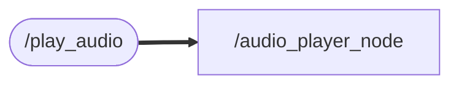

# audio_player_cpp
Subscribeした音声を再生するNode
### Node and Topic

## Dependency
    sudo apt-get update
    sudo apt-get install alsa-utils   #WAVファイル用
    sudo apt-get install mpg123       #MP3ファイル用

## Setup
    cd ~/ros2_ws/src  #Go to ros workspace

    git clone https://github.com/iHaruruki/audio_player_cpp.git #clone this package

    cd ~/ros2_ws

    colcon build --symlink-install

    source install/setup.bash

## Usage
    ros2 run audio_player_cpp audio_player_node

    #トピックにメッセージを送信
    #音声再生のリクエスト（例: WAV ファイル）
    ros2 topic pub /play_audio std_msgs/String "data: '/absolute/path/to/your/sample_audio.wav'"
    #または MP3 ファイルの場合
    ros2 topic pub /play_audio std_msgs/String "data: '/absolute/path/to/your/sample_audio.mp3'"
    #for example
    ros2 topic pub /play_audio atd_msgs/String "data: '/audio/sample.mp3'"

## License
## Authors
## References
audio_player_cpp/audio/sample.mp3
https://pixabay.com/ja/music/search/sample/
